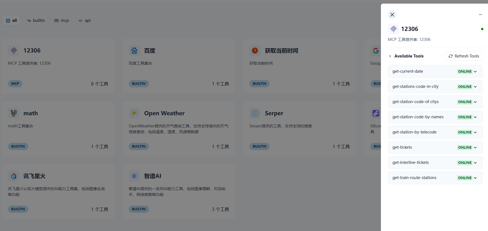
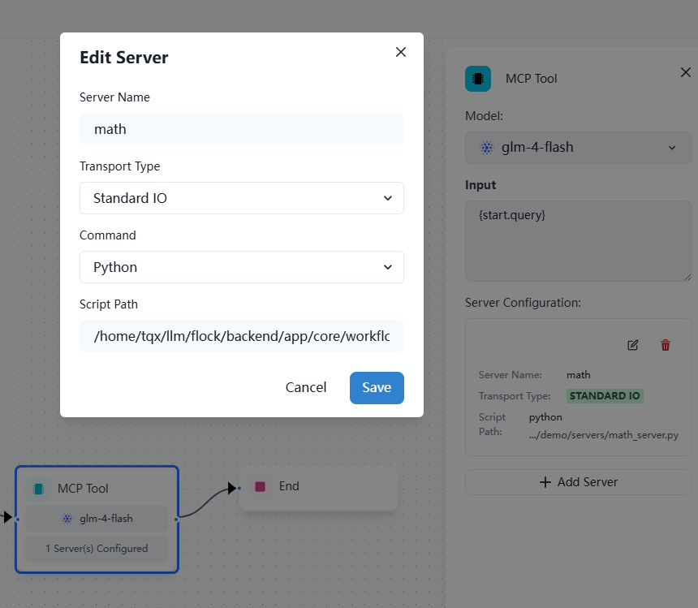

[](https://mseep.ai/app/onelevenvy-flock)

## 📃 Flock (Flexible Low-code Orchestrating Collaborative-agent Kits)

<p align="center">
  <a href="./docs/README_cn.md">简体中文</a> |
  <a href="./README.md">English</a> |
  <a href="#how-to-get-started">Getting Started</a>
</p>

> [!NOTE]
>
> ### 🎉 What's New 2025/8/2
>
> - **New MCP Tolls**: Added support for Streamble HTTP MCP Tools
> 
> ### 🎉 What's New 2025/5/9
>
> - **Agent Node Support**: Added dedicated Agent Node for seamless agent integration in workflows! Key features:
>   - 🧠 Create autonomous agents that can reason, plan, and execute tasks
>   - 🔄 Support for multiple agent types and architectures
>   - 🛠️ Easy configuration of agent tools, and behaviors
>   - 🔗 Seamless integration with other workflow nodes
>
> ### 🎉 What's New 2025/3/10
>
> - **MCP Tools Support**: Added MCP Node with support for Model Context Protocol (MCP) tools, enabling seamless integration with MCP servers! Key features:
>   - 🛠️ Convert MCP tools into LangChain tools for use with LangGraph agents
>   - 📦 Connect to multiple MCP servers and dynamically load tools from them
>   - 🔄 Support both stdio and SSE transport modes for flexible communication
>   - 🔗 Seamless integration with existing LangChain workflows
>   
>
> ### 🎉 What's New 2025/2/25
>
> - **Parameter Extractor Node**: Added parameter extraction node that can automatically extract structured information from text and output in JSON format!
>
> ### 🎉 What's New 2025/1/21
>
> - **Subgraph Node Support**: Added subgraph node that allows you to encapsulate and reuse complete sub-workflows!
>
>   - 📦 Modular: Encapsulate complex workflows as standalone subgraph nodes
>   - 🔄 Reusable: Reuse the same subgraph node across different workflows
>   - 🎯 Maintainable: Update and maintain sub-workflow logic independently
>
> ### 🎉 What's New 2025/1/8
>
> - **Human Node**: Added a new human-in-the-loop node supporting key scenarios:
>   - 🛠️ Tool Call Review: Human review, edit, or approve tool calls requested by the LLM
>   - ✅ LLM Output Validation: Human review, edit, or approve content generated by the LLM
>   - 💡 Context Provision: Enable LLM to request human input for clarification or additional details
>
> ### 🎉 What's New 2024/12/23
>
> - **Multimodal Chat Support**: Added support for multimodal chat (currently only supports image modality, with more modalities coming soon)!  
>   

> ### 🎉 What's New 2024/12/18
>
> - **If-Else Node**: Added If-Else node to support conditional logic in workflows! The node supports various condition types including Contains, Not contains, Start with, End with, Is, Is not, Is empty, and Is not empty. Multiple conditions can be combined using AND/OR operators for complex conditional logic, allowing you to create sophisticated branching workflows based on your data.

> ### 🎉 What's New 2024/12/7
>
> - **Code Execution Node**: Added Python code execution capabilities to workflows! This node allows you to write and execute Python scripts directly within your workflow, supporting variable references and dynamic data transformations. Perfect for arithmetic operations, data processing, text manipulation, and custom logic that goes beyond preset node functionalities.

> ### 🎉 What's New 2024/11/12
>
> - **Intent Recognition Node**: New Intent Recognition node that can automatically identify user input intent based on preset categories, supporting multi-classification routing!
>   
>
> - **CrewAI Node Support**: Now you can leverage CrewAI's powerful multi-agent capabilities in your workflows! Create sophisticated agent teams and orchestrate complex collaborative tasks with ease.
>   

### Flock is a workflow-based low-code platform for rapidly building chatbots, RAG applications, and coordinating multi-agent teams. Built on LangChain and LangGraph, it provides a flexible, low-code orchestrating solution for collaborative agents, supporting chatbots, RAG applications, agents, and multi-agent systems, with the capability for offline operation.

<video src="https://private-user-images.githubusercontent.com/49232224/386539219-5dc96133-72f3-4cc3-9f50-096c38bde715.mp4?jwt=eyJhbGciOiJIUzI1NiIsInR5cCI6IkpXVCJ9.eyJpc3MiOiJnaXRodWIuY29tIiwiYXVkIjoicmF3LmdpdGh1YnVzZXJjb250ZW50LmNvbSIsImtleSI6ImtleTUiLCJleHAiOjE3MzE2NjMzNDQsIm5iZiI6MTczMTY2MzA0NCwicGF0aCI6Ii80OTIzMjIyNC8zODY1MzkyMTktNWRjOTYxMzMtNzJmMy00Y2MzLTlmNTAtMDk2YzM4YmRlNzE1Lm1wND9YLUFtei1BbGdvcml0aG09QVdTNC1ITUFDLVNIQTI1NiZYLUFtei1DcmVkZW50aWFsPUFLSUFWQ09EWUxTQTUzUFFLNFpBJTJGMjAyNDExMTUlMkZ1cy1lYXN0LTElMkZzMyUyRmF3czRfcmVxdWVzdCZYLUFtei1EYXRlPTIwMjQxMTE1VDA5MzA0NFomWC1BbXotRXhwaXJlcz0zMDAmWC1BbXotU2lnbmF0dXJlPWVhOWY1NTc1Mjk5YWU1MjZmNmQyNmY3Mzk0YjY2MGYyMzlmZWQ2MTVkMjExODEwNmY3YmMxYTVmNGRhNzMxZWEmWC1BbXotU2lnbmVkSGVhZGVycz1ob3N0In0.69R3pTktxrl8C6tdduABLiRhkhwdfeVO3vlGGTGK4to" data-canonical-src="https://private-user-images.githubusercontent.com/49232224/386539219-5dc96133-72f3-4cc3-9f50-096c38bde715.mp4?jwt=eyJhbGciOiJIUzI1NiIsInR5cCI6IkpXVCJ9.eyJpc3MiOiJnaXRodWIuY29tIiwiYXVkIjoicmF3LmdpdGh1YnVzZXJjb250ZW50LmNvbSIsImtleSI6ImtleTUiLCJleHAiOjE3MzE2NjMzNDQsIm5iZiI6MTczMTY2MzA0NCwicGF0aCI6Ii80OTIzMjIyNC8zODY1MzkyMTktNWRjOTYxMzMtNzJmMy00Y2MzLTlmNTAtMDk2YzM4YmRlNzE1Lm1wND9YLUFtei1BbGdvcml0aG09QVdTNC1ITUFDLVNIQTI1NiZYLUFtei1DcmVkZW50aWFsPUFLSUFWQ09EWUxTQTUzUFFLNFpBJTJGMjAyNDExMTUlMkZ1cy1lYXN0LTElMkZzMyUyRmF3czRfcmVxdWVzdCZYLUFtei1EYXRlPTIwMjQxMTE1VDA5MzA0NFomWC1BbXotRXhwaXJlcz0zMDAmWC1BbXotU2lnbmF0dXJlPWVhOWY1NTc1Mjk5YWU1MjZmNmQyNmY3Mzk0YjY2MGYyMzlmZWQ2MTVkMjExODEwNmY3YmMxYTVmNGRhNzMxZWEmWC1BbXotU2lnbmVkSGVhZGVycz1ob3N0In0.69R3pTktxrl8C6tdduABLiRhkhwdfeVO3vlGGTGK4to" controls="controls" muted="muted" class="d-block rounded-bottom-2 border-top width-fit" style="max-height:640px; min-height: 200px">
 </video>

### 🤖️ Overview

 

### Work Flow

 

### Node Types and Functions

Flock's workflow system consists of various node types, each serving a specific purpose:

1. Input Node: Processes initial input and converts it into a format the workflow can handle.
2. LLM Node: Utilizes large language models for text generation and processing.
3. Retrieval Node: Fetches relevant information from knowledge bases.
4. Tool Node: Executes specific tasks or operations, extending workflow functionality.
5. Retrieval Tool Node: Combines retrieval capabilities with tool functionality.
6. Intent Recognition Node: Automatically identifies user input intent based on preset categories and routes to different processing flows.
7. Answer Node: Generates final answers or outputs, integrating results from previous nodes.
8. Subgraph Node: Encapsulates a complete sub-workflow, allowing for modular design.
9. Start and End Nodes: Mark the beginning and end of the workflow.

Future planned nodes include:

- File Upload Node
- Parameter Extraction Node

These nodes can be combined to create powerful and flexible workflows suitable for various complex business needs and application scenarios.

### Image Tools use


### Knowledge Retrieval


### Human in the loop (human approval or let the LLM rethink or ask human for help)

<p>
  
  
</p>

Inspired by the [StreetLamb](https://github.com/StreetLamb) project and its [tribe](https://github.com/StreetLamb/tribe) project , Flock adopts much of the approach and code.
Building on this foundation, it introduces some new features and directions of its own.

Some of the layout in this project references [Lobe-chat](https://github.com/lobehub/lobe-chat), [Dify](https://github.com/langgenius/dify), and [fastgpt](https://github.com/labring/FastGPT).
They are all excellent open-source projects, thanks🙇‍.

### 👨‍💻 Development

Project tech stack: LangChain + LangGraph + React + Next.js + Chakra UI + PostgreSQL

### 💡RoadMap

1 APP

- [x] ChatBot
- [x] SimpleRAG
- [x] Hierarchical Agent
- [x] Sequential Agent
- [x] Work-Flow
- [x] Intent Recognition Node - Automatically identify user input intent and route to different processing flows
- [x] CrewAI Integration
- [ ] More muti-agent ---On Progress

2 Model

- [x] OpenAI
- [x] ZhipuAI
- [x] Siliconflow
- [x] Ollama
- [x] Qwen
- [x] Xinference

3 Ohters

- [x] Tools Calling
- [x] I18n
- [ ] Langchain Templates

### 🏘️Highlights

- Persistent conversations: Save and maintain chat histories, allowing you to continue conversations.
- Observability: Monitor and track your agents' performance and outputs in real-time using LangSmith to ensure they operate efficiently.
- Tool Calling: Enable your agents to utilize external tools and APIs.
- Retrieval Augmented Generation: Enable your agents to reason with your internal knowledge base.
- Human-In-The-Loop: Enable human approval before tool calling.
- Open Source Models: Use open-source LLM models such as llama, Qwen and Glm.
- Multi-Tenancy: Manage and support multiple users and teams.

### How to get started

#### 1. Deploy with Docker Compose

##### 1.1 Method 1: Pull Frontend and Backend Images from Docker Hub

```bash
# Clone the repository
git clone https://github.com/Onelevenvy/flock.git

# Navigate to the docker directory
cd flock/docker

# Copy the environment configuration file
cp ../.env.example .env

# Start docker compose
docker compose up -d

#  Access Frontend
# Local environment
http://localhost:4433

# Server environment
http://your_server_ip:4433
```

#### 1.2 Method 2: Locally Build Frontend and Backend Images

```bash
# Clone the repository
git clone https://github.com/Onelevenvy/flock.git

# Navigate to the docker directory
cd flock/docker

# Copy the environment configuration file
cp ../.env.example .env

# First, build the frontend and backend images
docker compose -f docker-compose.localbuild.yml build
# Then start docker compose
docker compose -f docker-compose.localbuild.yml up -d
```

#### 2. Start with Local Source Code

##### 2.1 Preparation

##### 2.1.1 Clone the Code

git clone https://github.com/Onelevenvy/flock.git

##### 2.1.2 Copy Environment Configuration File

```bash
cp .env.example .env
# Modify environment variables in .env file as needed
```

##### 2.1.3 Generate Secret Keys

Some environment variables in the .env file have default values set to 'changethis'.
You must change these to secret keys. To generate a secret key, you can run the following command:

```bash
python -c "import secrets; print(secrets.token_urlsafe(32))"
```

Copy the output and use it as your password/key. Run the command again to generate another secure key.

##### 2.1.4 Install postgres, qdrant, redis

```bash
cd docker
docker compose --env-file ../.env up -d
```

#### 2.2 Run Backend

##### 2.2.1 Install Basic Environment

Server startup requires Python 3.12.x. It's recommended to use pyenv for quick Python environment installation.

To install additional Python versions, use pyenv install:

```bash
pyenv install 3.12
```

To switch to the "3.12" Python environment, use the following command:

```bash
pyenv global 3.12
```

Follow these steps:
Navigate to the "backend" directory:

```bash
cd backend
```

Activate the environment:

```bash
uv sync --python 3.12  
```

##### 2.2.2 Initialize Data

```bash
# Migrate database
alembic upgrade head
```

##### 2.2.3 Run unicorn

```bash
uvicorn app.main:app --reload --log-level debug
```

##### 2.2.4 Run celery (not required unless you want to use rag functionality)

```bash
poetry run celery -A app.core.celery_app.celery_app worker --loglevel=debug
```

#### 2.3 Run Frontend

##### 2.3.1 Enter web directory and install dependencies

```bash
cd web
pnpm install
```

##### 2.3.2 Start web service

```bash
cd web
pnpm dev

# or pnpm build then pnpm start
```

## Star History

[](https://star-history.com/#Onelevenvy/flock&Date)
