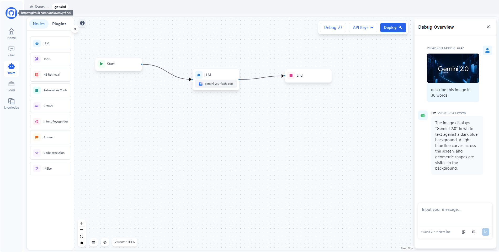
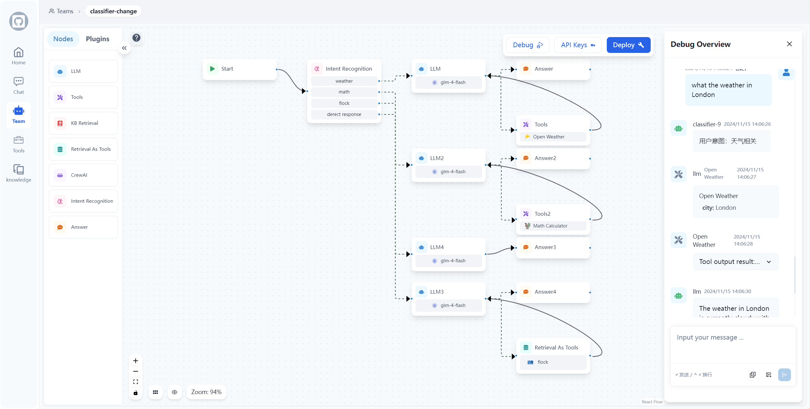

## 📃 Flock (Flexible Low-code Orchestrating Collaborative-agent Kits)

<p align="center">
  <a href="./README_cn.md">简体中文</a> |
  <a href="../README.md">English</a> |
  <a href="#如何开始">快速开始</a>
</p>

> [!TIP]
>
> ### 🎉 最新更新 2025/8/2
>
> - **New MCP Tolls**: 增加对Streamble HTTP 协议的MCP工具的支持
> 
>
> ### 🎉 最新更新 2025/5/9
>
> - **Agent节点支持**: 新增专用Agent节点，实现工作流中的无缝代理集成！主要特性：
>   - 🧠 创建可以推理、规划和执行任务的自主代理
>   - 🔄 支持多种代理类型和架构
>   - 🛠️ 轻松配置代理的工具和行为
>   - 🔗 与其他工作流节点无缝集成
>
> ### 🎉 最新更新 2025/3/10
>
> - **MCP工具支持**: 新增MCP Node，增加了对MCP（Model Context Protocol）工具的支持，实现与MCP服务器的无缝集成！主要特性：
>   - 🛠️ 将MCP工具转换为LangChain工具，可用于LangGraph Agent
>   - 📦 支持连接多个MCP服务器并动态加载其工具
>   - 🔄 支持stdio和SSE两种传输模式实现灵活通信
>   - 🔗 与现有LangGraph工作流无缝集成
>   
>
> ### 🎉 最新更新 2025/2/25
>
> - **参数提取节点**: 新增参数提取节点，可以自动从文本中提取结构化信息,以json的形式输出！
>   
>
> ### 🎉 最新更新 2025/1/21
>
> - **Subgraph Node 支持**: 新增子图节点 Subgraph Node 支持，允许您在工作流中封装和重用完整的子工作流！
>
>   - 📦 模块化：将复杂工作流封装为独立的子图节点
>   - 🔄 可重用：在不同工作流中复用相同的子图节点
>   - 🎯 易维护：独立更新和维护子工作流逻辑
>
> ### 🎉 最新更新 2025/1/8
>
> - **Human Node（人机协作节点）**: 新增人机协作节点，支持以下关键场景：
>   - 🛠️ 工具调用审核：人工审核、编辑或批准 LLM 请求的工具调用
>   - ✅ LLM 输出验证：人工审核、编辑或批准 LLM 生成的内容
>   - 💡 提供上下文：允许 LLM 主动请求人工输入以获取澄清或补充信息，支持多轮对话

> ### 🎉 最新更新 2024/12/23
>
> - **多模态对话支持**: 新增多模态对话的支持（目前仅支持图片模态，后续会陆续增加对其他模态的支持）！
>   

> ### 🎉 最新更新 2024/12/18
>
> - **If-Else 节点**: 新增 If-Else 节点以支持工作流中的条件逻辑！该节点支持多种条件类型，包括：包含、不包含、开始是、结束是、是、不是、为空、不为空。可以使用 AND/OR 运算符组合多个条件进行复杂的条件判断，让您能够基于数据创建复杂的分支工作流。

> ### 🎉 最新更新 2024/12/7
>
> - **代码执行节点**: 新增 Python 代码执行功能！该节点允许您在工作流中直接编写和执行 Python 代码，支持变量引用和动态数据转换。它非常适合算术运算、数据处理、文本操作等场景，让您能够实现超越预设节点功能的自定义逻辑。

> ### 🎉 最新更新 2024/11/12
>
> - **意图识别节点**: 新增意图识别节点,可以根据预设的类别自动识别用户输入的意图,支持多分类路由!
>   
>
> - **CrewAI 节点支持**: 现在您可以在工作流中使用 CrewAI 的强大多代理功能！轻松创建复杂的代理团队并编排复杂的协作任务。
>   

### Flock 是一个基于工作流 workflow 的低代码平台，用于快速构建聊天机器人、RAG 应用和协调多代理团队。它基于 LangChain 和 LangGraph 构建，提供灵活的低代码编排协作代理解决方案，支持聊天机器人、RAG 应用、代理和多代理系统，并具备离线运行能力。

<video src="https://private-user-images.githubusercontent.com/49232224/386539219-5dc96133-72f3-4cc3-9f50-096c38bde715.mp4?jwt=eyJhbGciOiJIUzI1NiIsInR5cCI6IkpXVCJ9.eyJpc3MiOiJnaXRodWIuY29tIiwiYXVkIjoicmF3LmdpdGh1YnVzZXJjb250ZW50LmNvbSIsImtleSI6ImtleTUiLCJleHAiOjE3MzE2NjMzNDQsIm5iZiI6MTczMTY2MzA0NCwicGF0aCI6Ii80OTIzMjIyNC8zODY1MzkyMTktNWRjOTYxMzMtNzJmMy00Y2MzLTlmNTAtMDk2YzM4YmRlNzE1Lm1wND9YLUFtei1BbGdvcml0aG09QVdTNC1ITUFDLVNIQTI1NiZYLUFtei1DcmVkZW50aWFsPUFLSUFWQ09EWUxTQTUzUFFLNFpBJTJGMjAyNDExMTUlMkZ1cy1lYXN0LTElMkZzMyUyRmF3czRfcmVxdWVzdCZYLUFtei1EYXRlPTIwMjQxMTE1VDA5MzA0NFomWC1BbXotRXhwaXJlcz0zMDAmWC1BbXotU2lnbmF0dXJlPWVhOWY1NTc1Mjk5YWU1MjZmNmQyNmY3Mzk0YjY2MGYyMzlmZWQ2MTVkMjExODEwNmY3YmMxYTVmNGRhNzMxZWEmWC1BbXotU2lnbmVkSGVhZGVycz1ob3N0In0.69R3pTktxrl8C6tdduABLiRhkhwdfeVO3vlGGTGK4to" data-canonical-src="https://private-user-images.githubusercontent.com/49232224/386539219-5dc96133-72f3-4cc3-9f50-096c38bde715.mp4?jwt=eyJhbGciOiJIUzI1NiIsInR5cCI6IkpXVCJ9.eyJpc3MiOiJnaXRodWIuY29tIiwiYXVkIjoicmF3LmdpdGh1YnVzZXJjb250ZW50LmNvbSIsImtleSI6ImtleTUiLCJleHAiOjE3MzE2NjMzNDQsIm5iZiI6MTczMTY2MzA0NCwicGF0aCI6Ii80OTIzMjIyNC8zODY1MzkyMTktNWRjOTYxMzMtNzJmMy00Y2MzLTlmNTAtMDk2YzM4YmRlNzE1Lm1wND9YLUFtei1BbGdvcml0aG09QVdTNC1ITUFDLVNIQTI1NiZYLUFtei1DcmVkZW50aWFsPUFLSUFWQ09EWUxTQTUzUFFLNFpBJTJGMjAyNDExMTUlMkZ1cy1lYXN0LTElMkZzMyUyRmF3czRfcmVxdWVzdCZYLUFtei1EYXRlPTIwMjQxMTE1VDA5MzA0NFomWC1BbXotRXhwaXJlcz0zMDAmWC1BbXotU2lnbmF0dXJlPWVhOWY1NTc1Mjk5YWU1MjZmNmQyNmY3Mzk0YjY2MGYyMzlmZWQ2MTVkMjExODEwNmY3YmMxYTVmNGRhNzMxZWEmWC1BbXotU2lnbmVkSGVhZGVycz1ob3N0In0.69R3pTktxrl8C6tdduABLiRhkhwdfeVO3vlGGTGK4to" controls="controls" muted="muted" class="d-block rounded-bottom-2 border-top width-fit" style="max-height:640px; min-height: 200px">
 </video>

### 🤖️ 概览


### 工作流


### 节点类型和功能

Flock 的工作流系统由各种类型的节点组成，每种节点都有特定的用途：

1. 输入节点：处理初始输入并将其转换为工作流可处理的格式。
2. LLM 节点：利用大型语言模型进行文本生成和处理。
3. 检索节点：从知识库中获取相关信息。
4. 工具节点：执行特定的任务或操作，扩展工作流功能。
5. 检索工具节点：结合检索能力和工具功能。
6. 意图识别节点：根据预设类别自动识别用户输入意图并路由到不同的处理流程。
7. 回答节点：生成最终答案或输出，整合前序节点的结果。
8. 子图节点：封装完整的子工作流，允许模块化设计。
9. 开始和结束节点：标记工作流的开始和结束。

未来计划添加的节点包括：

- 文件上传节点
- 参数提取节点

这些节点可以组合创建强大而灵活的工作流，适用于各种复杂的业务需求和应用场景。

### 图像工具调用


### 知识检索


### Human-in-the-Loop（人工审批或让 LLM 重新思考或寻求人工帮助）

<p>
  
  
</p>

本项目受到 [StreetLamb](https://github.com/StreetLamb) 项目及其 [tribe](https://github.com/StreetLamb/tribe) 项目的启发，采用了许多相似的方法和代码。在此基础上 我们引入了一些新的特性和方向。

项目的部分布局参考了 [Lobe-chat](https://github.com/lobehub/lobe-chat)、[Dify](https://github.com/langgenius/dify) 和 [fastgpt](https://github.com/labring/FastGPT)。
它们都是优秀的开源项目，在此表示感谢 🙇‍。

### 👨‍💻 开发技术

项目技术栈：LangChain + LangGraph + React + Next.js + Chakra UI + PostgreSQL

### 🏘️ 亮点特性

- 持久化对话：保存并维护聊天历史，使您能够继续之前的对话。
- 可观察性：使用 LangSmith 实时监控和跟踪代理的性能和输出，确保它们高效运行。
- 工具调用：使您的代理能够使用外部工具和 API。
- 检索增强生成：使您的代理能够利用内部知识库进行推理。
- 人机协作：在工具调用前启用人工审批。
- 开源模型：使用开源 LLM 模型，如 llama、Qwen 和 Glm。
- 多租户：管理和支持多个用户和团队。

### 如何开始

#### 1. 使用 Docker Compose 部署

##### 1.1 方法一：从 Docker Hub 拉取前端和后端镜像

```bash
# 克隆仓库
git clone https://github.com/Onelevenvy/flock.git

# 导航到 docker 目录
cd flock/docker

# 复制环境配置文件
cp ../.env.example .env

# 启动 docker compose
docker compose  up -d

# 访问前端界面
# 本地部署
http://localhost:4433

# 服务器部署
http://your_server_ip:4433

```

#### 1.2 方法二：本地 build 前端和后端镜像

```bash
# 克隆仓库
git clone https://github.com/Onelevenvy/flock.git

# 导航到 docker 目录
cd flock/docker

# 复制环境配置文件
cp ../.env.example .env

# 首先需要构建前端和后端镜像
docker compose -f docker-compose.localbuild.yml build
# 然后可以启动 docker compose
docker compose -f docker-compose.localbuild.yml up -d
```

#### 2. 使用本地源码部署

##### 2.1 准备工作

##### 2.1.1 克隆代码

git clone https://github.com/Onelevenvy/flock.git

##### 2.1.2 复制环境配置文件

```bash
cp .env.example .env
# 并按需修改 .env 文件中的环境变量
```

##### 2.1.3 生成密钥

.env 文件中的一些环境变量默认值为 "changethis"。
您必须将它们更改为密钥，要生成密钥，可以运行以下命令：

```bash
python -c "import secrets; print(secrets.token_urlsafe(32))"
```

复制内容并将其用作密码/密钥。再次运行该命令以生成另一个安全密钥。

##### 2.1.4 安装 postgres、qdrant、redis

```bash
cd docker
docker compose  --env-file ../.env up -d
```

#### 2.2 运行后端

##### 2.2.1 安装基本环境

服务器启动需要 Python 3.12.x。建议使用 pyenv 快速安装 Python 环境。

要安装其他 Python 版本，请使用 pyenv install。

```bash
pyenv install 3.12
```

要切换到 "3.12" Python 环境，请使用以下命令：

```bash
pyenv global 3.12
```

按照以下步骤操作：
导航到 "backend" 目录：

```bash
cd backend
```

激活环境。

```bash
uv sync --python 3.12  
```

##### 2.2.2 初始化数据

```bash

# 迁移数据库
alembic upgrade head

```

##### 2.2.3 运行 unicorn

```bash
 uvicorn app.main:app --reload --log-level debug
```

##### 2.2.4 运行 celery（非必需，除非您想使用 rag 功能）

```bash
poetry run celery -A app.core.celery_app.celery_app worker --loglevel=debug
```

#### 2.3 运行前端

##### 2.3.1 进入 web 目录并安装依赖

```bash
cd web
pnpm install
```

##### 2.3.2 启动 web 服务

```bash
cd web
pnpm dev

# 或者 pnpm build 然后 pnpm start
```

## Star History

[](https://star-history.com/#Onelevenvy/flock&Date)
